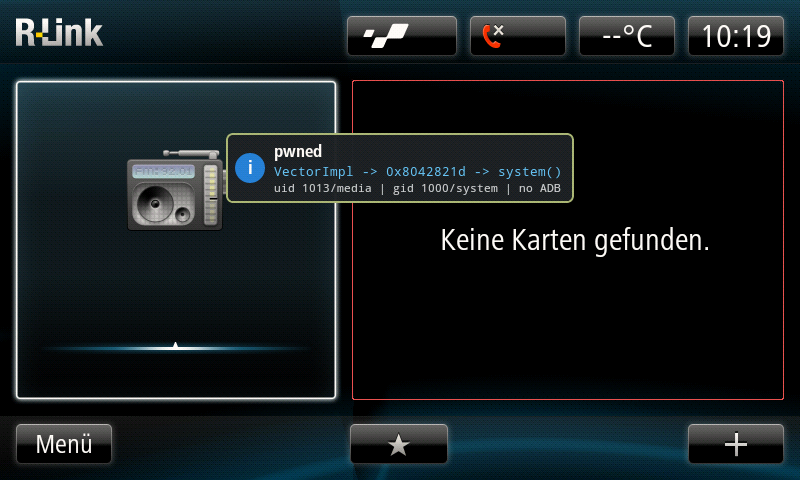

# Renault R-LINK 1 Stagefright

I wanted to enable Android Auto on a Renault R-LINK 1 Infotainment System, which you'd normally do by coding through OBD - but since the device sits on a separate CAN bus that most cheap dongles can't reach, this method requires basic soldering skills, which I seem to lack, lol. Luckily, the head unit runs an ancient version of Android (2.2 Froyo), so I wanted to try one of the more oldschool Android exploits - Stagefright - to gain arbitrary code execution and enable Android Auto this way.

The code in this repository allows you to generate malicious m4a files that, by copying them to a USB-stick that is then plugged into the head unit, will make the `mediaserver` service choke once it tries to index these mysterious, newly appeared media files, allowing you to execute arbitrary, unprivileged code.
Once you have convinced `mediaserver` to execute your code, it is then pretty straightforward to also gain root privileges, for example by messing with the config files of the GPS daemon.



> [!CAUTION]
> Beware: I don't take responsibility for you bricking your head unit. I'd
> suggest testing your payloads in QEMU before launching them in your actual
> car, but I'm not your dad, thankfully.

## How it works

The M4A overflows a `VectorImpl` in `mediaserver` (UID 1013). A static
return-oriented chain through libicuuc reaches the linker's
`__dl_restore_core_regs`, which pivots into `system()` without needing an
executable heap. The chain runs a script off the SD card and pops the original
stack frame cleanly.

A second stage plants a modified GPS config under `/data`.
On the next reboot, root-owned `gpsd`/`glgps` loads it and CBEE's helper hook
runs our script as UID 0. From there, a single EEPROM bit flip through the
firmware's own `eoltool` enables Android Auto.

## Quick start

### 1. Firmware setup

The exploit uses fixed addresses from the R-LINK firmware, so you need to
extract it first:

```sh
# firmware/R-LINK_11.344.zip must exist
python3 scripts/extract_firmware.py firmware/R-LINK_11.344.zip
```

You'll need Python 3, `debugfs` (`e2fsprogs`), and `tar`. Then prepare the emulator:

```sh
qemu/rlink-qemu build-qemu
qemu/rlink-qemu prepare
```

See [`qemu/README.md`](qemu/README.md) for configuration.

### 2. Build

```sh
exploit/car_android_auto/build.sh
```

The build produces four ZIPs under `exploit/usb_stick/`, one per stage:

| ZIP | What it does |
|-----|-------------|
| `01-visual-canary-with-logging` | Opens a hidden settings screen. Proof of execution, nothing written. |
| `02-android-auto-session-nonpersistent` | Starts a temporary AA session. Gone after reboot. |
| `03-eeprom-backup-dry-run` | Stages the root path and backs up the 8 KB EEPROM. |
| `04-enable-android-auto-persistent` | Flips the AA bit. The only permanent change. |

Extract one ZIP to a clean FAT32 card. Only one M4A should be on the card,
since the media scanner will try to index all of them.

### 3. Run

Start with ZIP 01. Plug the card in, let the head unit index it, and watch for
the hidden TestingSettings screen. Work through them in order, each one validates the next.

### 4. Tests

```sh
python3 exploit/test_static_trampoline_chain.py
python3 exploit/test_direct_restore_chain.py
python3 exploit/car_android_auto/test_car_zips.py
```

## Current state

The root privilege escalation through GPS/CBEE works in QEMU but still needs a
physical car run, since QEMU has no GPS chip for `glgps` to talk to.
`eoltool import` is not used because it processes all 49 settings sequentially
and can leave a partial write. The physical Ecu byte is `0x18 -> 0x58`; `0xC0`
in the tests is the QEMU baseline.

See [`exploit/car_android_auto/README.md`](exploit/car_android_auto/README.md)
for detailed payload notes.

## Disclaimer

This project was developed with the assistance of AI tools. AI was used for
tasks such as code generation, refactoring, debugging, documentation, reverse
engineering and general development support.
